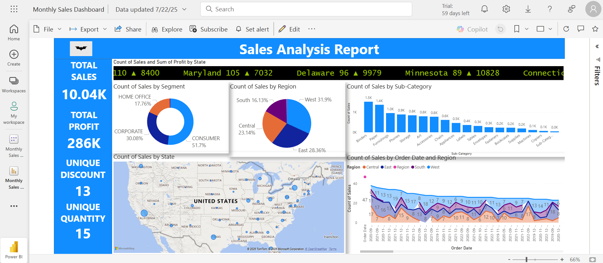
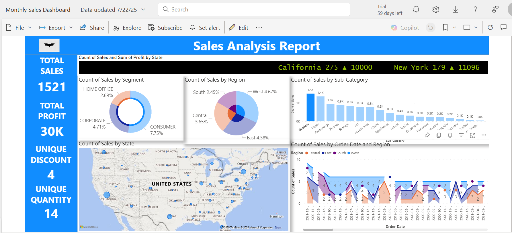
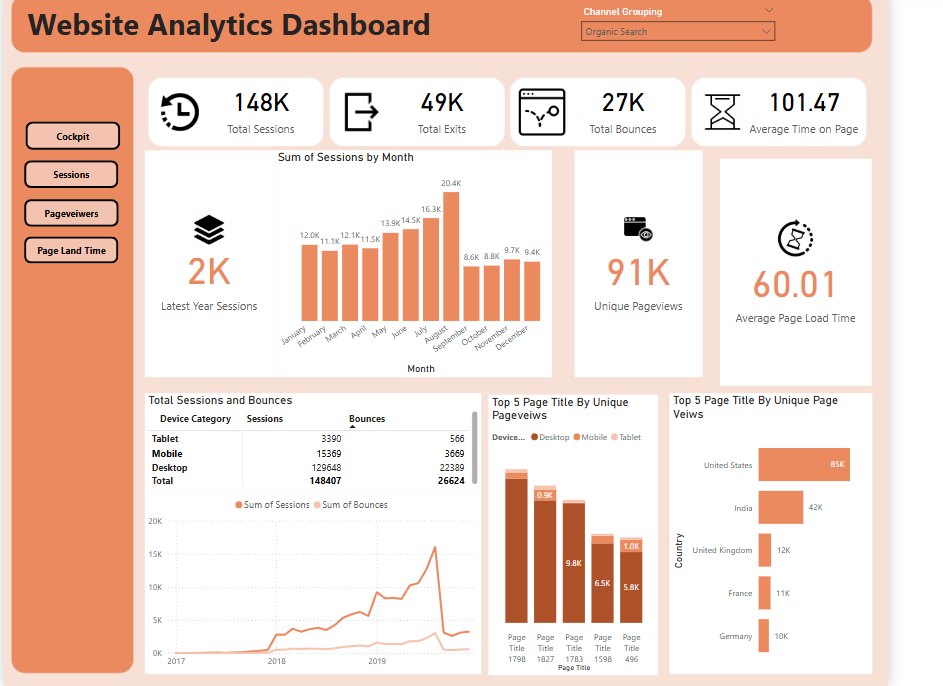

# Power BI Dashboard Collection

Welcome to my Power BI dashboard repository! This collection showcases various business intelligence dashboards created using Microsoft Power BI, demonstrating data visualization and analytical capabilities across different domains.

## 🖼️ Dashboard Gallery

### Monthly Sales Dashboard Preview

*Monthly Sales Dashboard - Main Overview*

*Monthly Sales Dashboard - Detailed View*

### Web Analytics Dashboard Preview

*Web Analytics Dashboard - Traffic and User Behavior Analysis*

### Additional Dashboard Previews
*More dashboard images coming soon...*

## 📊 Dashboard Overview

### 1. Monthly Sales Dashboard
**File:** `Monthly Sales Dashboard.pbix`
- **Purpose:** Track and analyze monthly sales performance
- **Key Features:**
  - Monthly sales trends and patterns
  - Performance metrics and KPIs
  - Sales data visualization
  - Time-series analysis

### 2. HR Data Dashboard
**File:** `HR Data Dashboard.pbix`
- **Purpose:** Human Resources analytics and insights
- **Key Features:**
  - Employee demographics and statistics
  - HR metrics and performance indicators
  - Workforce analytics
  - Organizational insights

### 3. Super Store Sales Data
**File:** `Super store sales data.pbix`
- **Purpose:** Retail sales analysis for superstore operations
- **Key Features:**
  - Product category performance
  - Regional sales analysis
  - Customer segmentation
  - Profitability analysis

### 4. Vehicle Sales Data
**File:** `Vehicle Sales Data.pbix`
- **Purpose:** Automotive sales performance tracking
- **Key Features:**
  - Vehicle sales trends
  - Model performance comparison
  - Sales territory analysis
  - Revenue optimization insights

### 5. E-commerce Dashboard
**File:** `E commerce Dashboard.pdf` (PDF Report)
- **Purpose:** Online business performance analysis
- **Key Features:**
  - E-commerce metrics
  - Customer behavior analysis
  - Sales funnel visualization
  - Digital marketing insights

### 6. Web Analytics Dashboard
**File:** `Web analytics Dashboard Task 3.pbix`
- **Purpose:** Website performance and user behavior analysis
- **Key Features:**
  - Traffic analysis
  - User engagement metrics
  - Conversion tracking
  - Performance optimization insights

## 🛠️ Technical Information

- **Tool Used:** Microsoft Power BI Desktop
- **File Format:** .pbix (Power BI files), .pdf (Report exports)
- **Data Sources:** Various (Excel, CSV, databases, APIs)
- **Visualization Types:** Charts, graphs, tables, maps, KPI cards

## 📋 How to Use

1. **Download Power BI Desktop:** Install the latest version from [Microsoft's official website](https://powerbi.microsoft.com/desktop/)
2. **Open Dashboard Files:** Download the .pbix files and open them in Power BI Desktop
3. **Refresh Data:** Update data connections as needed for your environment
4. **Customize:** Modify visualizations and reports according to your requirements

## 🎯 Key Skills Demonstrated

- **Data Modeling:** Creating relationships between different data sources
- **DAX Functions:** Advanced calculations and measures
- **Data Visualization:** Creating compelling and interactive charts
- **Dashboard Design:** User-friendly and intuitive interface design
- **Business Intelligence:** Translating data into actionable insights

## 📈 Features Across Dashboards

- ✅ Interactive visualizations
- ✅ Drill-down capabilities  
- ✅ Filter and slicer functionality
- ✅ KPI tracking and monitoring
- ✅ Responsive design
- ✅ Data refresh capabilities
- ✅ Export functionality

## 📜 Certification

This repository also includes a **Certificate.pdf** documenting my Power BI skills and training completion.

## 🤝 Connect With Me

Feel free to explore these dashboards and reach out if you have any questions or would like to collaborate on Power BI projects!

## 📝 License

This project is for educational and portfolio demonstration purposes.

---

*Last Updated: July 2025*
*Repository: [Power-BI Dashboard Collection](https://github.com/dumbdead221/Power-BI)*
